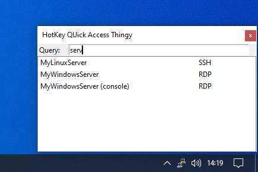
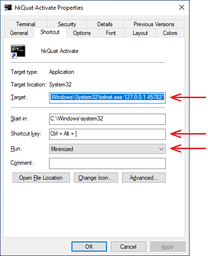

# hkQuat (HotKey QUick Access Tool / Thingy)

A simple tool for quick access to your preconfigured programs.

#### Usage:
* Press the hotkey, or double click on the systray icon
* Select the preferred programs using
	* Search bar
	* Arrow keys
	* Enter to activate selection
	* Esc key to cancel
	
#### Setup
* Requires Python 3
* Required modules: infi.systray
* Optional modules: keyboard *(see: Hotkey options)*

*Example: C:\Program Files\Python310\Scripts\pip.exe install infi.systray keyboard*

#### Hotkey options

hkQuat supports direct hotkey assignment using the Python keyboard module, however with Windows 10 assignments may be lost when e.g. locking your screen. To preserve hotkey functionality a workaround is available by using a local network connection using e.g. a telnet client, initiated from a windows shortcut on your desktop with a hotkey. A hotkey assigned to a desktop shortcut is preserved when locking/unlocking your desktop.

Install telnet in Windows and create a desktop icon with e.g. the following properties:
* Target: C:\Windows\System32\cmd.exe /C "C:\Windows\System32\telnet.exe 127.0.0.1 45782"
* Shortcut Key: Ctrl + Alt + ]
* Run: Minimized

Website: https://github.com/JCQ81
